# Introduction
MB-POST is a repository that stores both raw mass spectrometry data and the metadata that defines the measurement conditions. It uses the same system as the [jPOST repository (proteome data repository)](https://repository.jpostdb.org) and [GlycoPOST (glycome data repository)](https://glycopost.glycosmos.org), both of which have an established track record for ease of use and high performance.

<https://repository.massbank.jp>

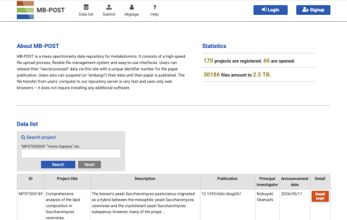{width=100%}

## Data Structure of MB-POST
MB-POST has two core concepts: "Projects" and "Presets."

- **Project**: A "container" for organizing submitted data.
- **Preset**: Used to describe the metadata for raw data; reusing presets reduces the effort required to enter metadata.

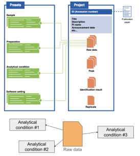{width=100%}

## Workflow for Submitting and Publishing a Project in MB-POST
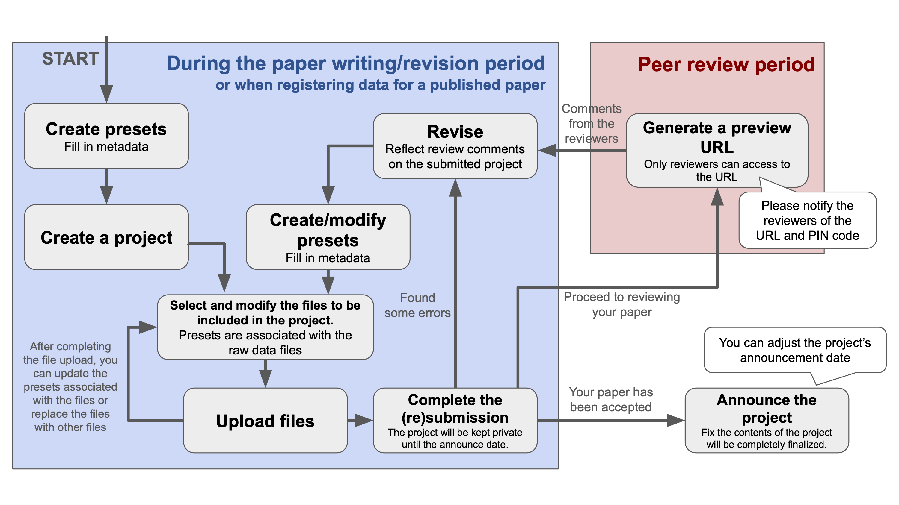{width=100%}

## About the Demo Site
MB-POST provides a demo site for testing and practicing submissions. It has essentially the same screen layout and features as MB-POST, and requires the same information to be entered.

It can be accessed at the following URL:

<https://rep-demo.massbank.jp>

## About the Sample Data
This manual uses data from the paper [A lipidome atlas in MS-DIAL 4 (Tsugawa *et al.*, Nat Biotechnol, 2020)](https://www.nature.com/articles/s41587-020-0531-2) as sample data to walk through the submission procedure.

The dataset is available at the following URLs:

- Raw data: <https://x.gd/VRkiD>
- Metadata: <https://x.gd/j6dDK>

# Submitting Data to MB-POST

## Preparing for Submission

### Checking Your Browser
Please use the latest version of one of the following browsers to access the site.

The latest versions offer better security and performance.

- Google Chrome
- Firefox
- Microsoft Edge
- Safari

### User Registration
A user account is required to submit data to MB-POST.

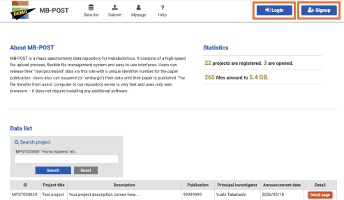{width=100%}

※ User information is not shared between the demo site and the main site (MB-POST), so you must register separately for each.

※ If you have already registered, log in via the top menu → "Login" and proceed to the next section, "Submission Workflow."

If you have not yet registered, create an account as follows:

1. Click "Signup" in the top menu. (The registration form will appear.)
2. Enter the following information:
    - A reachable email address
    - A password
    - Your full name
    - Your affiliation
    - [ORCiD ID](https://orcid.org) (optional)
3. Click the "Sign Up" button.
4. When "Successfully signed up." is displayed, registration is complete.

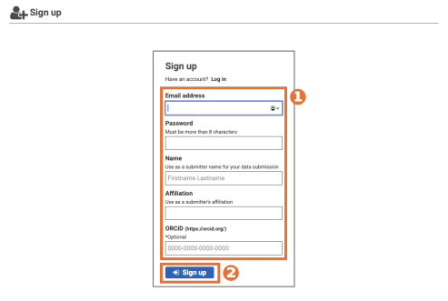{width=100%}

### Account Activation

Next, activate your account.

1. An account activation email will be sent to the email address you entered above.
2. Copy the "Token" string in the email body to your clipboard, then open the "URL" provided in the email.
3. On the page that opens, fill in the following fields in the form:
    - Email address
    - Password
    - The "Token" string you copied
4. Click the "Verify" button.
5. When "Successfully verified." is displayed, activation is complete.

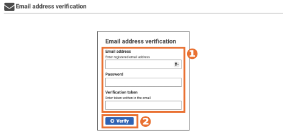{width=100%}

## Submission Workflow

### Types of Data to Submit
There are two types of data to register in MB-POST:

- **Raw data** — Files output by the mass spectrometer, database search results, and similar files. The files themselves are sent to the MB-POST server.
- **Metadata** — Information primarily related to experimental methods, such as "organism," "sample preparation method," and "analytical conditions." This is registered by typing or selecting text in an input form.

### Presets and Projects
The submission process is divided into two steps: "Preset" and "Project."

- **Preset**: The section for registering metadata. You register information related to the experimental methods, such as "the organism of the sample," "the sample preparation method," and "the analytical conditions." Because this information is recorded in the MB-POST database, it can be reused multiple times.
- **Project**: The section for sending raw data files. You enter information about the dataset you wish to submit and send files from your computer. You also link the raw data files to the previously created preset (metadata).

A single research output may consist of multiple raw data files, or it may be a single file.
What MB-POST treats as a "project" is the minimum meaningful unit of data publication — "the smallest unit (or larger) that would lose its meaning if separated"
(for example, please treat the control group and treatment group as a single project. If the same sample was measured using multiple analytical platforms such as LC-MS and GC-MS, it may be treated as a single project or split into separate projects as you see fit).
An accession number is issued per project.

### Registering a Preset
Navigate to the preset registration screen.

1. Click "Submit" in the top menu. (You will be taken to the Submission page.)
2. Click the blue item "Preset experimental procedure."

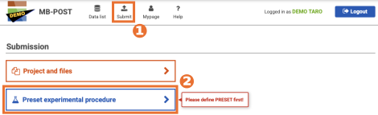{width=100%}

Presets are divided into the following four categories:

- **Sample**: Information about the sample (specimen) itself that is being analyzed.
- **Preparation**: Information about the method used to prepare the sample.
- **Analytical condition**: Information about the method used to separate and detect the sample, including the measurement mode when mass spectrometry is used.
- **Software setting**: Information about the software settings used during identification (molecular annotation) of experimental results.

You may fill these in any order, but this manual proceeds from top to bottom.

### Sample
Create a Sample preset.

1. Click the "Sample" tab. (The Sample tab is active by default.)
2. Click the "Add new preset" button. (The input form will open.)

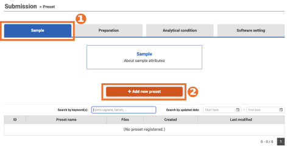{width=100%}

3. Fill in each field using the examples shown to the right of each input field as a guide. Fields marked with "[*]{.red}" are required.
4. When you have finished entering information, click the "Confirm" button. (You will be taken to a confirmation screen.)

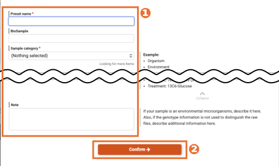{width=100%}

5. After reviewing the displayed information, click the "Submit preset" button. (The input form will close, and the data you just entered will be added to the list.)

### Preparation
Create a Preparation preset following the same procedure.

### Analytical condition
Create an Analytical condition preset following the same procedure.

### Software setting
Create a Software setting preset following the same procedure.

## Creating a Project
Navigate to the project creation screen.

1. Click "Submit" in the top menu. (You will be taken to the Submission page.)
2. Click the orange item "Project and files."

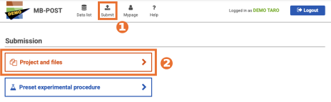{width=100%}

Input fields

| Field                  | Required/Optional | Description                                                                                        |
|------------------------|-------------------|----------------------------------------------------------------------------------------------------|
| Title                  | Required          | A label for the series of datasets.   Displayed in the project list.                            |
| Description            | Required          | A more detailed description of the dataset.                                                        |
| Keywords               | Required          | Keywords for the dataset, listed separated by commas.                                              |
| Announcement           |                   | Whether to publish the project immediately or at a later date.   "Unfixed" is recommended unless you have a specific intention. |
| Principal investigator | Required          | Name of the PI.                                                                                    |
| Affiliation            | Required          | Affiliation of the PI.                                                                             |
| Publication            |                   | PubMed ID or DOI.   This can also be entered later from the My page screen; you do not need to fill it in at this stage. |
| Note                   |                   | Any other information you wish to specify.                                                         |

1. Using the above as a guide, fill in each field. Fields marked with "[*]{.red}" are required.
2. When you have finished entering information, click the "Confirm" button. (You will be taken to a confirmation screen.)

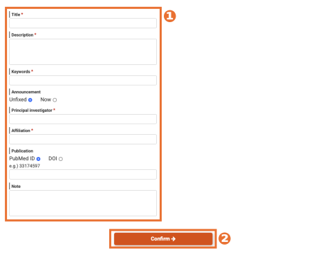{width=100%}

3. After reviewing the displayed information, click the "Submit Project" button. (The input form will close, and the entered data will be added to the list.)

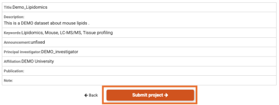{width=100%}

4. Select the project you just created from the list. (It will be selected automatically if you created it just now.)

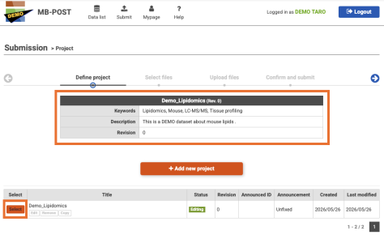{width=100%}

## Selecting Files to Submit
In the project section navigation, proceed to the next step: "Select files."

On this screen, you select and add the files from your computer that you wish to send to MB-POST.

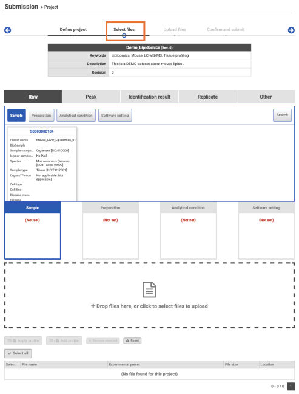{width=100%}

Files are added under the following five categories:

| Category              | Required/Optional | Description                        |
|-----------------------|-------------------|------------------------------------|
| Raw                   | Required          | Raw data                           |
| Peak                  |                   | Peak information                   |
| Identification result | Required          | Result data                        |
| Replicate             | Required          | Replicate experiment information   |
| Others                |                   | Other files                        |

### Raw
1. Select "Raw" in the file category tabs. (It is selected by default.)
2. Since you will link metadata presets to the raw files, select the presets appropriate for the files you want to add.
   (The selected presets will be displayed in the panel below.)

3. Select presets for each of the four categories: Sample, Preparation, Analytical condition, and Software setting.

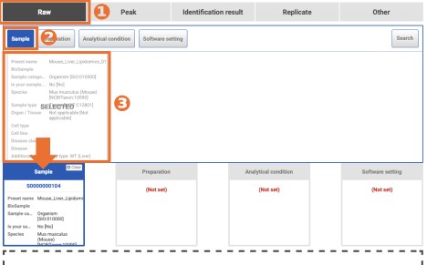{width=100%}

4. Once you have finished selecting presets, select and add files from your computer. Drag and drop them into the dotted-border area, or click the area to select them from a dialog.
   (Files will be added to the list at the bottom, and the titles of the linked presets will also be displayed.)

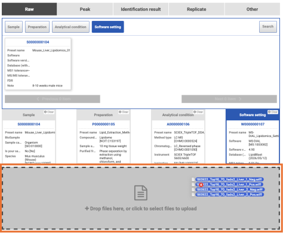{width=100%}

### Peak
Upload Peak files following the same procedure.

### Identification result
Upload Identification result (spectrum annotation results) files following the same procedure. Data matrix files can also be registered here.

The sample data used in this manual does not include identification (annotation) result files.

For the demo, we created the following placeholder data, but MB-POST recommends the [mzTab-M](https://github.com/HUPO-PSI/mzTab-M) format.

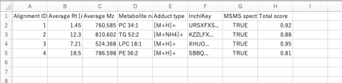{width=100%}

### Replicate
Create a Replicate file.

1. After linking presets to the raw data, click the "Generate replicates file" button. A template Excel file will be generated and downloaded.

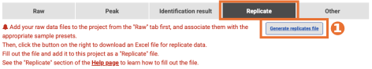{width=100%}

2. Enter integer values in the red-bordered area of the downloaded file.

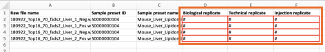{width=100%}

Field descriptions

| Field | Description              |
|-------|--------------------------|
| Biological replicate | A measurement taken from samples obtained from different biological individuals or independent samples.   Example: Liver tissue samples obtained separately from multiple mice that received the same treatment and measured individually. |
| Technical replicate  | Samples prepared from a single biological specimen that were independently pre-processed and measured.   Example: A single plasma sample split into two portions, each extracted and measured by MS separately. |
| Injection replicate  | A single prepared sample (already extracted and purified) that was injected into an LC-MS system or similar multiple times for measurement.   Example: A single lipid extract in one container (not aliquoted) that was measured by LC-MS three times. |

Upload the completed Excel file following the same procedure.

Additional notes on replicates are included in the appendix; please refer to that section.

### Others
Upload Other files following the same procedure.

## Uploading Files
In the project section navigation, proceed to the next step: "Upload files." You can confirm the files you added in the previous step in the list.

Click the "Upload files" button to begin the transfer.

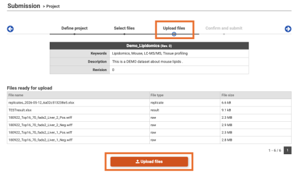{width=100%}

The upload speed from within Japan averages 9 MB/sec or more. This means a 1 GB file can be uploaded in approximately 2–3 minutes.

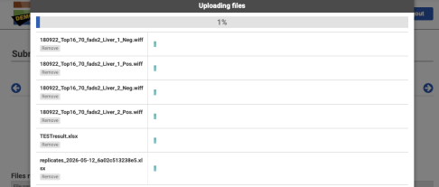{width=100%}

If the upload stalls partway through, try clicking the Remove button to remove the stalled file, and see if the upload can proceed for the other files first.
After the upload completion screen shown below appears, re-add the removed file to the project and attempt to upload it again.

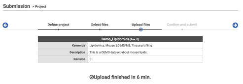{width=100%}

## Submitting
Once the upload is complete, proceed to the next step in the project section navigation: "Confirm and submit."

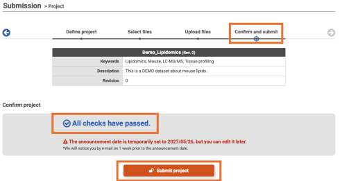{width=100%}

## Submission Requirements
If you have followed this manual up to this point, the project submission requirements should be met, and "All checks have passed." will be displayed in blue.

If any required information is missing, "Can't submit this project." will be displayed in red.

If you set "Announcement" to "Unfixed" when creating the project, the publication date will automatically be set to one year from now.

The project submission requirements are as follows:

- Raw file
- Identification result file
- Replicate file
- Organism information (included in the Sample preset)

## Completing the Submission
Click the "Submit project" button to complete the submission. You will be returned to the first step of the project section ("Define project"). In the project list table, confirm that the status of the relevant project has changed to "Submitted."

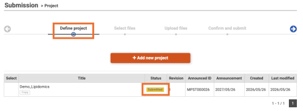{width=100%}

# Handling Projects After Submission
After submission is complete, only the following operations are available for a project. Editing is not possible.

- Revision
- Registering a PubMed ID or DOI
- Changing the publication date
- Issuing a preview URL

All of these operations can be performed from the My page screen (<https://rep-demo.massbank.jp/mypage>).

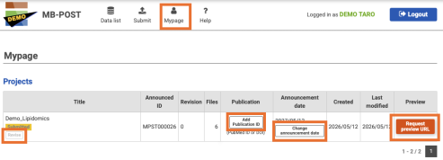{width=100%}

# Appendix

## About Replicates
- Enter replicate information for biological replicate, technical replicate, and injection replicate (※) in the respective columns, according to the classifications described above.
- To make it clear "which file is in a replicate relationship with which other file," enter **the sequential number indicating the position of that sample within the replicate series**, not the total number of replicates.
    - For example, if samples were obtained from 3 subjects at the same site and measured one sample each, yielding 3 raw data files:
    - NG: Because there are 3 biological replicates, enter "3" in the biological replicate field for all files.
    - OK: Assign each subject a sequential number from 1 to 3 and enter the corresponding number for each file.
- For convenience, injection replicates are subordinate to technical replicates, and technical replicates are subordinate to biological replicates. Sequential numbers must not span across a change in a higher-level replicate; in other words, when the sequential number of a higher-level replicate changes, the sequential number of the lower level resets to 1.
- Put another way, when filling in the table, if the number in any cell to the left of the cell you are entering changes, the sequential number resets to 1.
- When technical replicates are pooled and measured simultaneously, labels such as isobaric tags are added to distinguish the replicates. Although this operation looks like a pre-processing step applied to the sample, it should be considered "processing to distinguish samples," and the label information should be entered in the "Additional description" field of the Sample preset.
- This means you will need as many Sample presets — identical except for the label information — as there are labels. Use the preset copy function and similar features to prepare them.
- As an example, suppose samples were obtained from 3 subjects: samples from subjects 1 and 3 were prepared in 3 versions each ("as-is," "label 1 added," and "label 2 added"), pooled, and measured (raw data files 1 and 3); the sample from subject 2 was measured as-is (raw data file 2), and an additional measurement was taken after the other measurements were complete (raw data file 4). In this case, enter the sequential numbers as shown below:

    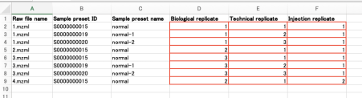{width=100%}

    - Additional rows describing the same file are added as needed. A file having multiple rows occurs when multiple samples are pooled and measured together.
    - Since the samples are aliquoted when labels are applied, they cannot be injection replicates and are instead technical replicates.
    - The data recorded in 2.mzml came from subject 2, but since it is the same as the "as-is" sample from subject 1, the same Sample preset applies. These two are distinguished by their biological replicate number.
    - 4.mzml is also from subject 2, but it is a measurement of the same sample that was measured to produce 2.mzml. Since both the biological and technical replicate numbers are the same, the injection replicate sequential number is 2.

- Note that if there is only one file (and no other files exist), filling in the value may seem pointless at first glance, but because the metadata file is intended to be processed computationally, please enter "1" even if it seems unnecessary.
- If you are preparing this table in advance (at your own pace), auto-generate the Excel file and, while confirming that the Raw file name and Sample preset name correspond row by row, copy the information into the auto-generated file. Be aware that the order of file names may have changed.
- For quality control purposes, the auto-generated file contains the metadata of that file, so please do not copy Sample preset IDs from your own file and submit them.

(※)

- In MB-POST, in addition to the standard distinction between technical replicates and biological replicates, we specifically add and define a category called "injection replicate."
    - This applies to cases where a collected sample is held in a single container, all pre-processing for that sample has been completed and the sample remains in a single container (e.g., a microtube), and it is then injected multiple times into the same MS system under the same conditions and analyzed.
        - That is, when a sample is divided into multiple portions and each is processed identically, there is a possibility that subtle differences arise in the processing
          (for example, when adding a reagent, the volume of reagent added might differ by approximately 0.05 µL).
          These differences could potentially manifest as differences in results (in the same way as when different mass spectrometers are used).

        - Therefore, based on this reasoning, we reserve the term "injection replicate" (rather than "technical replicate") exclusively for cases where measurements are repeated (with no division and only a single processing step performed in a single container) — i.e., where the contents are completely identical — rather than simply "samples that underwent the same processing."

    - Accordingly, each of the three categories means the following:
        - **Biological replicate** — Samples that are biologically treated as fully equivalent, yet come from different individuals. For example, samples from the same organ of different patients. Used to estimate lot-to-lot variability of samples.
        - **Technical replicate (other than injection replicate)** — Samples that are not merely equivalent but are the same sample originating from a single specimen, without necessarily implying that all subsequent pre-processing was completely identical (performed only once in a single container). Used to estimate variability arising from all work after sample collection (reagent addition and other pre-processing steps) and from the measurement environment.
        - **Injection replicate** — Cases where a single sample for which all pre-processing has been completed (ready for injection into the MS system) is injected into the MS system multiple times. Used to estimate variability attributable solely to the measurement environment, i.e., factors other than the sample being measured.
            - Note: If a single MS measurement takes a very long time and "the result of one measurement is split across multiple files," this is treated as an injection replicate for convenience, even though it differs from the original definition.
    - These distinctions are made in principle based on the differences that exist **before the sample is injected into the MS system**.

- Note: If it is certain that samples are replicates but they contain elements of both biological replicates and technical (or injection) replicates, classify them as biological replicates.

# Links
*  MB-POST (main site)
    -  <https://repository.massbank.jp>

*  Demo site
    -  <https://rep-demo.massbank.jp>

*  Help page (including video tutorials)
    -  <https://repository.massbank.jp/help>
