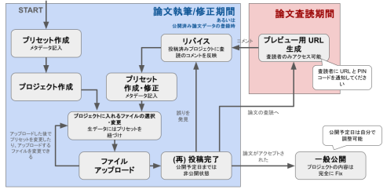

# はじめに
MB-POST とは質量分析生データと、その測定状態を規定するメタデータの両方を格納するリポジトリで、操作性の良さと高速性で既に実績のある [jPOST repository（プロテオーム・データリポジトリ）](https://repository.jpostdb.org)・[GlycoPOST（グライコーム・データリポジトリ）](https://glycopost.glycosmos.org) と同じシステムを用いています。

<https://repository.massbank.jp>

{width=100%}

## MB-POST のデータ構造
MB-POST には「プロジェクト」と「プリセット」という 2 つの概念があります

- **プロジェクト**: 投稿データをまとめておくための “入れ物”
- **プリセット**: 生データのメタデータを書くためのもので、再利用することでメタデータ入力の手間を削減

{width=100%}

## MB-POST でのプロジェクト投稿・公開の流れ
{width=100%}

## デモサイトについて
MB-POST では、投稿のテストや練習のためのデモサイトを開設しています。基本的には MB-POST と同じ画面構成・機能を備え、同じ情報の入力が必要です。

以下の URL よりアクセスできます。

<https://rep-demo.massbank.jp>

## サンプルデータについて
このマニュアルでは、 [A lipidome atlas in MS-DIAL 4 (Tsugawa *et al.*, Nat Biotechnol, 2020)](https://www.nature.com/articles/s41587-020-0531-2) という論文のデータをサンプルデータとして投稿の手順を説明します。

以下の URL にデータセットがあります。

- データ本体: <https://x.gd/VRkiD>
- メタデータ: <https://x.gd/j6dDK>

# MB-POST にデータを投稿する

## 投稿の準備

### 利用環境を確認する
以下のブラウザの最新バージョンを使用してアクセスしてください。

最新バージョンはセキュリティとパフォーマンスの面でより優れています。

- Google Chrome
- Firefox
- Microsoft Edge
- Safari

### ユーザー登録
MB-POST にデータを投稿するにはユーザー登録が必要です。

{width=100%}

※ デモサイトと本サイト（MB-POST）の間では情報は共有されませんので、それぞれにユーザー登録が必要です。

※ ユーザー登録済みの場合は、ページ上部メニュー→「Login」からログインして、次の「投稿の流れ」へ進んでください。

未登録の場合はユーザー登録を行います。

1. ページ上部メニュー→「Signup」をクリック。（入力画面が表示されます）
2. 以下の項目を入力します。
    - 連絡の取れるメールアドレス
    - パスワード
    - 氏名
    - 所属
    - [ORCiD ID](https://orcid.org) (任意)
3. 「Sign Up」ボタンをクリックします。
4. 「Successfully signed up.」と表示されれば完了です。

{width=100%}

### アカウント有効化

続いて、アカウントの有効化を行います。

1. 上で入力したメールアドレス宛に、アカウント有効化メールが送られてきます。
2. メール本文内にある「Token」の文字列をクリップボードにコピーし、「URL」を開きます。
3. 開いたページにあるフォームに以下の項目を入力します。
    - メールアドレス
    - パスワード
    - コピーした「Token」の文字列
4. 「Verify」ボタンをクリックします。
5. 「Successfully verified.」と表示されれば完了です。

{width=100%}

## 投稿の流れ

### 投稿するデータの種類
MB-POST に登録するデータは、2 種類です。

- **生データ**・・・質量分析計から出力されたデータやデータベースサーチ結果などのファイルです。ファイルそのものを MB-POST のサーバへ送信します。
- **メタデータ**・・・ 「生物種」「サンプル調製法」「分析条件」といった、主に実験手法に関わる情報です。入力フォームからテキストを入力・選択して登録します。

### プリセットとプロジェクト
投稿手順も2 つのステップに分かれています。「プリセット」と「プロジェクト」です。

- **プリセット**: メタデータを登録するセクションです。「そのサンプルの生物種」や「サンプル調製法」、「分析条件」といった、実験手法に関わる情報を登録します。この情報は MB-POST のデータベースに記録されるので、何度も再利用することができます。
- **プロジェクト**: 生データのファイルを送信するセクションです。投稿したいデータセットについての情報を入力し、コンピュータからファイルを送信します。生データファイルと前述のプリセット（メタデータ）の関連づけも行います。

1 つの研究結果は複数の生データファイルから構成されることもありますし、単一のファイルのこともあります。
MB-POST で「プロジェクト」として扱っているのは、データを公開するときの一つの単位、「分けてしまうと意味が判らなくなる最小 (以上の) 単位」です
(例えば、コントロール群と処理群は同一のプロジェクトとして扱ってください。また、同一サンプルに対して LC-MS やGC-MS など複数の分析系で測定した場合は、単一のプロジェクトとして扱っても、プロジェクトを分けても差し支えありません)。
アクセッション番号はプロジェクト単位で発行されます。

### プリセットを登録する
プリセット登録画面に移動します。

1. ページ上部メニュー→「Submit」をクリックします。（Submission ページへ移動します）
2. 青で表示された項目「Preset experimental procedure」をクリックします。

{width=100%}

プリセットは、以下の4 つのカテゴリに分かれています。

- **Sample**: 解析対象の試料（サンプル）自体について
- **Preparation**: 試料の調製方法について
- **Analytical condition**: 試料の分離・検出方法について、特に質量分析を用いた場合はその測定モードについて
- **Software setting**: 実験結果の同定（分子のアノテーション）の際に行ったソフトウェアの設定について

入力順序は自由ですが、本マニュアルでは上から順に入力していきます。

### Sample
Sample プリセットを作成します。

1. Sample タブをクリックします。（初期状態で Sample タブがアクティブになっています）
2. 「Add new preset」ボタンをクリックします。（入力フォームが開きます）

{width=100%}

3. 各入力欄の右にある例を参考に入力していきます。「[*]{.red}」のついている項目は必須です。
4. 入力が完了したら「Confirm」ボタンをクリックします。（入力内容の確認画面に移ります）

{width=100%}

5. 表示内容を確認したら「Submit preset」ボタンをクリックします。（入力画面が閉じて、いま入力したデータが一覧表に追加された状態になります）

### Preparation
同様の手順で Preparation プリセットを作成します。

### Analytical condition
同様の手順で Analytical condition プリセットを作成します。

### Software setting
同様の手順で Software setting プリセットを作成します。

## プロジェクトを作成する
プロジェクト作成画面に移動します。

1. ページ上部メニュー→「Submit」をクリックします。（Submission ページへ移動します）
2. オレンジ色の項目「Project and files」をクリックします。

{width=100%}

入力項目

| 項目                   | 必須/任意 | 説明                                                                                              |
|------------------------|-----------|---------------------------------------------------------------------------------------------------|
| Title                  | 必須      | 一連のデータセットのラベル   プロジェクトの一覧表に表示される                                  |
| Description            | 必須      | データセットについてのより詳細な説明                                                              |
| Keywords               | 必須      | データセットについてのキーワードをカンマ区切りで列挙                                              |
| Announcement           |           | プロジェクトをすぐに公開するか、後日に公開するか   特別な意図がない限りは Unfixed のままを推奨 |
| Principal investigator | 必須      | PI の名前                                                                                         |
| Affiliation            | 必須      | PI の所属先                                                                                       |
| Publication            |           | PubMed ID か DOI   この時点では入力せず、My page 画面でも入力できる                            |
| Note                   |           | その他に明記したい情報                                                                            |

1. 上記を参考に、各項目を入力します。「[*]{.red}」のついている項目は必須です。
2. 入力が完了したら「Confirm」ボタンをクリックします。（入力内容の確認画面に移ります）

{width=100%}

3. 表示内容を確認したら「Submit Project」ボタンをクリックします。（入力画面が閉じて、入力したデータが一覧表に追加された状態になります）

{width=100%}

4. 一覧表から作成したプロジェクトを選択します。（作成した直後であれば自動的に選択されています）

{width=100%}

## 送信するファイルを選択する
プロジェクトセクションのナビゲーションで、次の「Select files」に進みます。

この画面では、MB-POST へ送信するファイルをコンピュータから選択・追加します。

{width=100%}

ファイルは以下の 5 つのカテゴリごとに追加します。

| 項目                  | 必須/任意 | 説明                 |
|-----------------------|-----------|----------------------|
| Raw                   | 必須      | 生データ             |
| Peak                  |           | ピーク情報           |
| Identification result | 必須      | 結果データ           |
| Replicate             | 必須      | レプリケート実験情報 |
| Others                |           | その他               |

### Raw
1. ファイルカテゴリのタブで「Raw」を選択します。（初期状態では選択されています）
2. Raw のファイルにメタデータのプリセットを関連づけるので、追加したいファイルに適したプリセットを選択します。
（選択されたプリセットが下部のパネルに表示されます）

3. Sample, Preparation, Analytical condition, Software setting の 4 つのカテゴリのプリセットをそれぞれ選択していきます。

{width=100%}

4. プリセットの選択が終わったら、コンピュータからファイルを選択・追加します。点線で囲まれたエリアにドラッグ＆ドロップ、または、エリアをクリックしてダイアログから選択してください。
（下部のリストにファイルが追加され、関連づけたプリセットのタイトルも表示されます）

{width=100%}

### Peak
同様の手順で Peak ファイルをアップロードします。

### Identification result
同様の手順で Identification result（スペクトルのアノテーション結果）ファイルをアップロードします。Data matrix ファイルもここで登録できます。

今回、例として示したデータには同定結果（アノテーション）ファイルは含まれていません。

デモでは以下のような仮のデータを作成して使いましたが、 MB-POST では [mzTab-M](https://github.com/HUPO-PSI/mzTab-M) 形式を推奨しています。

{width=100%}

### Replicate
Replicate ファイルを作成します。

1. 生データへのプリセット紐づけのあと「Generate replicates file」ボタンをクリックすると、テンプレートの Excel ファイルが生成されてダウンロードされます。

{width=100%}

2. ダウンロードされたファイルの赤枠部分に、整数値を入力します。

{width=100%}

入力項目について

| 項目                 | 説明 |
|--------|------------------------|
| Biological replicate | 異なる生物個体あるいは独立したサンプルから得られた試料を測定したもの   例）同じ処理をした複数のマウスから得た肝臓試料を別個に測定する |
| Technical replicate  | 同一の生物学的サンプルから調製された試料を、独立に前処理・測定したもの   例）1 つの血漿試料を 2 つに分け、それぞれ別個に抽出・MS 測定を行う |
| Injection replicate  | 同一の調製済みサンプル（抽出済み・精製済み）を、複数回 LC-MS などに注入して測定したもの   例）分注していない、一つの容器に入った脂質抽出物を 3 回 LC-MS 測定する |

作成した Excel ファイルを、同様の手順でアップロードします。

なお、replicate についての追加の解説を付録として収録しましたので、ご参照ください。

### Others
同様の手順で Others ファイルをアップロードします。

## ファイルを送信する
プロジェクトセクションのナビゲーションで、次の「Upload files」に進みます。先ほど追加したファイルが一覧表で確認できます。

「Upload files」ボタンをクリックすると送信が始まります。

{width=100%}

日本国内からのファイル送信速度は、平均して 9 MB/sec（以上）です。これは 1 GB のファイルであれば 2〜3 分でアップロードできる計算になります。

{width=100%}

なお、アップロードの途中で進まなくなってしまった場合は、アップロード中のファイルを Remove ボタンで除去することで先に他のファイルのアップロードを進められないかを試してみて下さい。
除去されたファイルは以下のアップロード完了画面が表示されたあと、改めてプロジェクトに追加し直して再アップロードしてみてください。

{width=100%}

## 投稿する
アップロードが完了したら、プロジェクトセクションのナビゲーションで、次の「Confirm and submit」に進みます。

{width=100%}

## 投稿の必須条件
ここまで本マニュアルどおりに進めてきた場合には、プロジェクト投稿の条件を満たしているはずですので、青の文字で「All checks have passed.」と表示されています。

登録した情報に不足がある場合には、赤色の文字で「Can\'t submit this project.」と表示されます。

プロジェクト作成時に、「Announcement」を「Unfixed」にしておくと、自動的に公開日時を 1 年後として設定します。

プロジェクト投稿の条件は以下です。

- Raw ファイル
- Identification result ファイル
- Replicate ファイル
- 生物種の情報（Sample プリセットに含まれる）

## 投稿を完了する
「Submit project」ボタンをクリックすることで、投稿を完了することができます。プロジェクトセクションの最初のステップ（「Define project」）に戻り、プロジェクト一覧テーブルで、該当のプロジェクトのステータスが「Submitted」になったことを確認してください。

{width=100%}

# プロジェクト投稿後の扱い
投稿が完了したプロジェクトに対しては、以下の操作のみ可能です。再編集はできません。

- リバイス
- PubMed ID, DOI の登録
- 公開日の変更
- Preview 用 URL の発行

これらはいずれも Mypage 画面 (<https://rep-demo.massbank.jp/mypage>) より操作できます。

{width=100%}

# 付録

## replicate について
- biological replicate, technical replicate, injection replicate（※）のそれぞれの列に、上記の分類に従ってそれぞれのreplicate の情報を入力してください。
- 「どのファイルとどのファイルがreplicate の関係にあるのか」がはっきりわかるように、「replicate の個数」ではなく、「そのサンプルがreplicate の何番目かを示す連番」を記入してください。
    - 例えば3 人の被験者から同一部位の試料を得て1 試料ずつ測定し、3 個の生データファイルを得た場合；
    - NG: biological replicate は 3 個だから、全てのファイルのbiological replicate の項目に「3」と記入
    - OK: 被験者に便宜的に 1 〜 3 の番号を振り、対応するファイルに該当する番号を記入
- 便宜的に、injection replicate よりもtechnical replicate を上位、technical replicate よりもbiological replicate を上位と分類し、「連番は、異なる上位replicate をまたがってつけない」「自分よりも上位のreplicate の連番が変わると、自分の連番も1 にリセットされる」という形で入力してください。
- 言い換えると、表に入力するとき、入力しようとしているセルよりも左にあるセルの数字が 1 つでも変化したら、連番は 1 に戻ります。
- technical replicate を混合して同時に測定する場合、replicate の区別をするために isobaric tag のようなラベルを付加します。この作業は試料に対する前処理に見えますが、「試料を区別するための処理」と考えて、Sample プリセットの「Additional description」にラベル情報を記入してください。
- したがってラベルの個数だけ、ラベル情報以外は同一のSample プリセットが必要になります。プリセットのcopy 機能などを使って準備してください。
- 例として、3 人の被験者から試料を得、被験者 1 と 3 の試料は「そのまま、ラベル1 を付加、ラベル 2 を付加」の 3 種類を準備し混合して測定（生データファイル 1 と 3）、被験者 2 の試料はそのまま測定し（生データファイル 2）、他の測定が終了後もう一度測定を追加した（生データファイル 4）、とします。この場合は以下のように連番を入力します：

    {width=100%}

    - 必要なだけ、同一ファイルを説明する行が追加されています。一つのファイルの行が複数個になるのは、複数の試料を混合して測定した場合です。
    - ラベルを付加した段階で試料は分取していますから、これらはinjection replicateにはなり得ずtechnical replicate になります。
    - 2.mzml にデータが記録された試料は被験者2 番からのものですが、被験者1 番の「そのまま」と同一なのでSample プリセットは同一です。この両者はbiological replicate 番号で区別されます。
    - 4.mzml は同じく被験者2 番からのものですが、2.mzml を測定したときと同一の試料を測定しており、biological / technical の両replicate が同一なので、injection replicate の連番が2 となります。

- なお、ファイルが1 つしかない場合には（それ以外のファイルはないのだから）一見、記入する意味がありませんが、メタデータファイルを機械的に処理することが念頭に置かれているため、無意味なようでも「1」を記入してください。
- このような表を事前に（ゆっくり）準備しておく場合、Excel ファイルを自動生成し、行ごとにRaw file name とSample preset name が対応していることを確認しながら、自動生成ファイルにコピーしてください。ファイル名の順番などが変わっていることがあり得ますので注意してください。
- ファイルの品質管理のため、自動生成ファイルにはそのファイルのメタデータが記録されているので、自分のファイルにSample preset ID をコピーして提出することは避けてください。

（※）

- MB-POST では、一般的なtechnical replicate とbiological replicate の区別に加えて特に、injection replicate という区分を追加して定義します。
    - これは、採取された試料は単一容器に入っており、それに対する前処理をすべて終えた試料も一つの容器（マイクロチューブなど）に入っているときに、これを同一条件のMS 系に複数回injection して解析した場合が該当します。
        - つまり試料を複数個に分割した場合、それぞれに同一の処理を行なっても、処理の内容に微妙な差が生じている可能性はあります
          （例えば試薬を加えるとき、その試薬の分量が0.05μℓほど異なっている、というような可能性があります）。
          この差異が（測定に用いた質量分析計が異なる場合と同様）結果の差異となって現れる可能性はあり得ます。

        - 従ってこのような考えに基づいて、（単に「同一の処理を施した試料」ではなく）「処理なども完全に同一（単一の容器内で1 回のみ実施）で、中身が完全に同一の試料」を複数回測定した場合に限って、replicate のことを（technical replicate ではなく）「injection replicate」と呼ぶことにします。

    - したがってこの3 分類のそれぞれが意味するのは、以下のことになります；
        - biological replicate ... 生物学的には全く等価として扱われる、しかし異なった試料。例えば別の患者の同じ臓器由来の試料。試料のロット差を見積もる
        - technical replicate other than injection replicate … 単一の被検体由来の（単に等価ではなく）同一の試料。必ずしも、その後の前処理が完全に同一（単一の容器内で1 回のみ実施）であることは意味しない。試料採取以後の全ての作業（試薬の投入他前処理）・測定環境に起因する結果のばらつきなどを見積もる
        - injection replicate … 前処理などを全て終えた（後はMS 系に投入するだけ、という段階の）一つの試料を複数回MS 系に投入した場合。実際に測定する試料以外に起因する、すなわち測定環境のみに起因する結果のばらつきなどを見積もる
            - なお、1 回のMS 測定に非常に時間がかかるため「1 回の測定結果が複数個のファイルに分割された」場合は、（本来の定義とは異なりますが）便宜上injection replicate として扱います。
    - これらの区別は、原則として「MS 系に試料をinjection する前」までの差で区別します。

- なお、「replicate であることは確かだが、biological replicate とtechnical （またはinjection） replicate の両方の要素を含む」という場合は、biological replicate に分類します。

# リンク集
*  MB-POST（本サイト）
    -  <https://repository.massbank.jp>

*  デモサイト
    -  <https://rep-demo.massbank.jp>

*  ヘルプページ（動画解説含む）
    -  <https://repository.massbank.jp/help>

